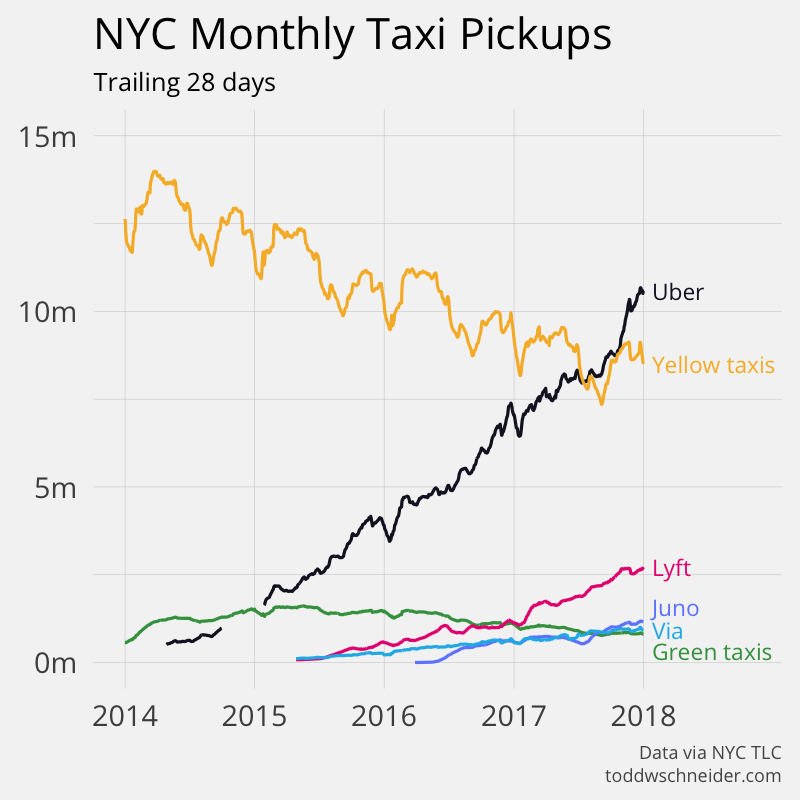

```{r, message=FALSE, echo=FALSE}
library(knitr)
opts_chunk$set(tidy.opts=list(width.cutoff=50),tidy=TRUE,
               fig.width=6, fig.height=6)
```

# Introduction
## Motivation
Working with medium data in R is not an easy task. Loading medium-sized data into R environment takes a long time and might crush an R session. Creating a user-friendly platform that allows R users to easily work with medium data is my motivation. There are a lot of interesting data that are needed to be explored. In my study, I focus on New York City taxicab data, because there is so much that could be learned from taxicab trip records. 

New York City taxi drivers, passengers, and NYC Taxi & Limousine Commission are the three parties who are closely involved in the NYC taxi industry. Each party has its own needs. Better understanding the needs of the three parties and provide solutions to better satisfy their needs are what I am hooping to be the result of this thiesis.

## Background
### Yellow Taxi
The Yellow Cabs are widely recognized as the icons of New York City. NYC Taxicabs are operated by private firms and licensed by the New York City Taxi and Limousine Commission (TLC).  TLC issues medallions to taxicabs, and every taxicab must have a medallion to operate. There were 13,437 yellow medallion taxicabs licenses in 2014, and taxi patronage has declined since 2011 because of the competition caused by rideshare services.

### Green Taxi
The apple green taxicabs in New York City are called Boro taxis and they are allowed to only pick up passengers in outer boroughs and in Manhattan above East 96th and West 110th Streets. Historically, only the yellow medallion taxicabs were allowed to pick up passengers on the street. However, since 95% of yellow taxi pick-ups occurred in Manhattan to the South of 96th Street and at the two airports, Five Borough Taxi Plan was started to allow green taxis to fill in the gap in outer boroughs.

### Uber
Uber Technologies Inc., famously known as Uber, is an American technology company that operates private cars worldwide. Uber drivers use their own cars, instead of corporate-owned vehicles, to drive with Uber.  In NYC, Uber uses ‘upfront pricing”, meaning that riders are informed about the fares that they will pay before requesting a ride, and gratuity is not required. Riders are given the opportunity to compare different transportation fares before making their decisions on which one to choose. Uber NYC was launched in May 2011, and it only took 5 years to have its growth to plateau.   

### Lyft
Similar to Uber, Lyft is also an on-demand transportation company, and it operates the Lyft car transportation mobile app. Lyft is the main competitor of Uber, and it came into market in July 2014 in New York City.


## Literature Review 
### etl R package
in `R Markdown: Integrating A Reproducible Analysis Tool into Introductory Statistics`, the authors have presented experimental and statistical evidence that R Markdown replaced the antiquated and hard-to-reproduce `copy-and-paste workflow`, and makes creating fully-reprodicible statistical analysis straight-forward. [@baumer2014r]

Loading medium-sized data into R environment takes a long time and might crush an R session. `etl` R package creates a user-friendly platform that allows R users to easily work with medium data with the extract, transform, load framework, which is commonly konwn as ETL in computing. [@wikipedia] The `ETL` process has been set up by Benjamin Baumer [@pkgetl] in R to facilitate etl operations for medium data, and it is designed to work with any general data set. Packages that are specific to  perticular data sets are needed to be written in order to better work with complex medium-sized data sets.

### New York City Traffic and Taxi
New York City is the most famous and popular city in the United States, and the New York City yellow cabs are recognized as the icon of New York City. New York City's traffic is a popular topic in Journalism, and different aspects of it has been studied by journalists. New York City's traffic is a nightmare, and the city officials have always been trying to solve the congestion problem. In 2009, New York City was voted to be the U.S. city with the `angriest and most aggressive drivers`. [@reaney2009] The bad temper of drivers are caused by New York City's severe cogestion. 

How bad is the cogestion? In a journal published by New York Post in 2016, New York City was described as "the city that never moves". [@furfaro2016] What has led to the congestion in the city? An journal from New York Post tried to find an answer to this question: According to a former top NYPD official, "The city streets are being engineered to create traffic congestion, to slow traffic down, to favor bikers and pedestrians" so that drivers will have the incentive to leave their cars at home and turn to mass transit or bicycles.[@sugar2017] 

No matter how miserable the driving experiences are, taxi drivers have no luxury to choose alternative transportation, and instead thay have to consistently driver their cabs, which are usually surrounded by bad traffic, in order to make a living.

### Competition between New York City taxi and e-hail services

As shown in the visulization above, which was generated by Todd W. Schneider [@schneider2015], the number of New York City yellow taxi trips has been consistently declining for about 4 years, and the numbers of Uber and Lyft trips keep increasing. In 2017, for the first time, the total number of monthly uber trips has exceeded the number of yellow taxi trips. 

Studies that show how competitive Uber and Lyft are have been done. In 2017, Uber and Lyft vehicles outnumbered NYC yellow cabs by 4 to 1. [@sugar2017] Even though Yellow cab is still an icon of New York City, passengers nowadays tend to choose the more convenient options, ride-hailing apps.[@hu2017]

As reported in a jounal from Forbes Tech, data scientists from the University of Cambridge in the UK and the University of Namur in Belgium found that yellow taxi rides are on average \$1.4 cheaper than Uber X. Moreover, uber appears more expensive for trips that are cheaper than \$35, and less expensive than yellow taxi ride for trips that are more expensive than \$35. Therefore, for short trips, taking a taxi is more affordable. [@guerrini2015]

Apps, such as Openstreetcab, that compares the price of Uber and taxi trips are designed to help customers to compare the fares of different transportations. [@appone]

## Contribution
### nyctaxi Package
nyctaxi is an etl-dependent R package that help users to easily get access to New York City Taxi, Uber and Lyft trip data through Extract, Transform, and Load functions (ETL). This package facilitates ETL to deal with medium data that are too big to store on a laptop. Users are given the option to choose specific years and months as the input parameters of the three ETL functions, and a populated SQL database will be returned as the output. Users do not need to learn SQL queries, since all user interaction is in R.

```{r, message=FALSE}
library(webshot)
webshot("https://github.com/beanumber/nyctaxi","r-nyctaxi.png")
```

### Social Impact of NYC Taxi
New York City taxi drivers, passengers, and NYC Taxi & Limousine Commission are the three parties who are closely involved in the NYC taxi industry. Each party has its own needs: taxi drivers want to maxmize their profit, and in order to do that, they need to maximize the revenue while minimizing the cost. Taxi passengers want the cheapest and most convenient way of transportantion. Since Uber and Lyft launched their services in New York City, many consumers started to demand the cheaper e-hail services. TLC wants to protect both taxi drivers and passengers, and it creates policies to make NYC taxi more accessible to consumers who really need this service. In this section, I think about what each party wants and try to find a way for them to be better-off. 

### Reproducible Research
Reproducible research and open sources are the very first things that Ben mentioned to me in the beginning of my honors project. As scholars place more emphasis on the reproducibility of research studies, it is essential for me to make my dat and code openly available for people to eith redo my analysis or test my result. 

`Knitr` and Github are used in my project to make my study reproducible, ranging from the initial source to raw data to the package I wrote to utlize the raw data to the statistical data analysis. I used an Github Ripository called `thesisdown` to layout the basic structure of my paper, this tool allows students to create reproducible and dynamic techinical report in R Markdown. It also allows users to embed R code and interactive applicationis, and output into PDF, Word, ePub, or gitbook doocuments. `thesisdown` helps users to efficiently put together any paper with similar format.

Github is used to store the scripts for `nyctaxi` and this thesis. `nyctaxi` is available on CRAN for people to download and install, and the source code for data analysis in this thesis is available under the Github account of the author so that scholars can easyil access the  information that thery are interested in. In terms of tables, figures, and anything included in the Appendix attached to this thesis, scripts that are used to generate them are included in the Github repository.  
