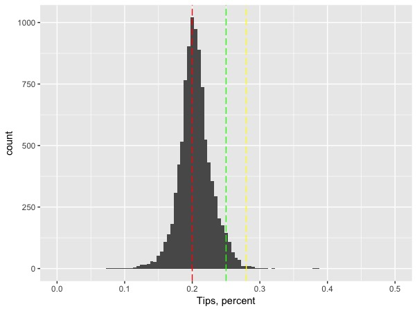
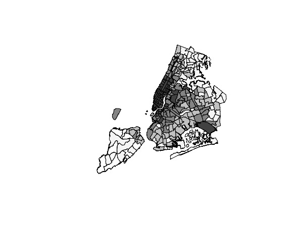

# Using New York City Yellow Taxi Data to Answer Real Life Problems {#chapter2}
New York City taxi drivers, passengers, and NYC Taxi & Limousine Commission are the three parties who are closely involved in the NYC taxi industry. Each party has its own needs: taxi drivers want to maxmize their profit, and in order to do that, they need to maximize the revenue while minimizing the cost. Taxi passengers want the cheapest and most convenient way of transportantion. Since Uber and Lyft launched their services in New York City, many consumers started to demand the cheaper e-hail services. TLC wants to protect both taxi drivers and passengers, and it creates policies to make NYC taxi more accessible to consumers who really need this service. In this section, I think about what each party wants and try to find a way for them to be better-off. 

## New York City Taxi Driver
### Which pick-up zone has the highest tip?
#### Trip-level Tip Inofrmation
The income of Taxi drivers in New York City has two parts: taxi fare and tips. Taxi fare is usually calculated by the meters installed in the taxis, and the rate of fare cannot be changed by taxi drivers. Therefore, in order to make more profit, taxi drivers prefer to pick up passengers who offer big amount of tips. What are the regions that provide the most tips to yellow taxicab drivers?

In the following analysis, I will focus on trip data collected in August 2016. Taxi drivers usually does not correctly record the amount of tips paid by cash or check. Therefore, in order to find out the regions that offer the most tips, we need to filter out the trips that are not paid by credit or debit card.

```{r, eval=FALSE}
yellow_2016.08_tip <- yellow_2016.08 %>%
  filter(fare_amount > 0) %>%
  filter(tip_amount > 0) %>%
  filter(payment_type == 1) %>%
  filter(tip_amount < fare_amount)
```

Instead of the absolute amount of tips, we want to focus on the percentage of tips that passengers pay in addition to the total fare amount. 

```{r, eval=FALSE}
yellow_2016.08_tip <- yellow_2016.08_tip %>%
  mutate(tip_perct = tip_amount/fare_amount)
```

Let's visualize the distribution of tip percentage:
```{r, eval=FALSE}
library(ggplot2)
tip_individual <- ggplot(data = yellow_2016.08_tip, aes(x = tip_perct) ) +
  xlab("Tips, percent") +
  geom_histogram(binwidth = 0.005) + 
  geom_vline(xintercept = c(0.20), col = "red",linetype = "longdash") +
  geom_vline(xintercept = c(0.25), col = "green",linetype = "longdash") +
  geom_vline(xintercept = c(0.28), col = "yellow",linetype = "longdash")
tip_individual
```


One of the questions that I always wonder is whether longer trips result in higher tip percent. It takes taxi drivers more time to complete longer trips, so passengers might want to compensate taxi drivers more. I personally pay higher percent of tips for longer rides, so I believe trip distance has an impact on percentage of tips paid.

```{r, eval=FALSE}
tip_distance <- lm(tip_perct ~ trip_distance, data = yellow_2016.08_tip)
summary(tip_distance)
```

---
Call:
lm(formula = tip_perct ~ trip_distance, data = yellow_2016.08_tip)

Residuals:
     Min       1Q   Median       3Q      Max 
-0.21887 -0.01889  0.00244  0.02682  0.77850 

Coefficients:
                Estimate Std. Error  t value Pr(>|t|)    
(Intercept)    2.189e-01  2.812e-05 7785.080   <2e-16 ***
trip_distance -4.146e-09  8.729e-09   -0.475    0.635    

Signif. codes:  0 ‘***’ 0.001 ‘**’ 0.01 ‘*’ 0.05 ‘.’ 0.1 ‘ ’ 1

Residual standard error: 0.06938 on 6088289 degrees of freedom
Multiple R-squared:  3.706e-08,	Adjusted R-squared:  -1.272e-07 
F-statistic: 0.2256 on 1 and 6088289 DF,  p-value: 0.6348
---

Acoording to the simple linear regression result, trip distance does not have significant impact on the percent of tips paid.

#### Aggregated Zone-level Tip Information

```{r, eval=FALSE}
tip_region <- yellow_2016.08_tip  %>%
  group_by(PULocationID, DOLocationID) %>%
  summarise(avg_tip = mean(tip_perct), trips = n(),
            avg_dis = mean(trip_distance)) %>%
  filter(trips > 10) %>%
  arrange(desc(avg_tip)) %>%
  rename(LocationID = PULocationID) %>%
  left_join(taxi_zone_lookup, by = "LocationID")
```

```{r, eval=FALSE}
#zone
region_vis <- ggplot(data = tip_region, aes(x = avg_tip) ) +
  xlab("Tips, percent") +
  geom_histogram(binwidth = 0.005) + 
  geom_vline(xintercept = c(0.20), col = "red",linetype = "longdash") +
  geom_vline(xintercept = c(0.25), col = "green",linetype = "longdash") +
  geom_vline(xintercept = c(0.28), col = "yellow",linetype = "longdash") + 
  scale_x_continuous(limits = c(0, 0.5))
```


```{r, eval=FALSE}
tip_pickup <- tip_region %>%
  group_by(PULocationID) %>%
  summarise(avg_tip = mean(avg_tip), num_trips=sum(trips)) %>%
  left_join(taxi_zone_lookup, by = "LocationID") %>%
  arrange(desc(avg_tip)) %>%
  filter(Zone != "Unknown")

region_pickup_vis <- region_vis %+% tip_pickup
region_pickup_vis
```


```{r, eval=FALSE}
tip_dropoff <- tip_region %>%
  group_by(DOLocationID) %>%
  summarise(avg_tip = mean(avg_tip)) %>% 
  rename(LocationID = DOLocationID) %>%
  left_join(taxi_zone_lookup, by = "LocationID")

region_dropoff_vis <- region_pickup_vis %+% tip_dropoff
region_dropoff_vis
```


Taxi drivers are required to be indifferent to where passengers are going. Therefore, it makes more sense to investigate the average amount of tips paid for each pick-up zone. What are the taxi zones that have the highest tip percents?

Let's fist take a look at which zones have the highest number of pickups.
```{r, eval=FALSE}
names(taxi_zones)
names(pickup_zone)
newobj <- merge(taxi_zones, tip_pickup, by.x = "LocationID", by.y = "LocationID")
cols <- brewer.pal(n = 4, name = "Greys")
lcols <- cut(newobj$num_trips,
             breaks = quantile(newobj$num_trips, na.rm = TRUE),
             labels = cols)
plot(newobj, col = as.character(lcols))
```


#### What are the zones with the highest tip percent?
```{r, eval=FALSE}
#pick a threshold for the cutoff of number of trips
pickup_zone_1000 <- tip_pickup %>%
  filter(num_trips >= 1000) %>%
  arrange(desc(avg_tip))

library(knitr)
kable(pickup_zone_1000[1:10,2:5], caption = "Taxi zone with the highest tip percent, threshold = 1000")
```

```{r, eval=FALSE}
#pick a threshold for the cutoff of number of trips
pickup_zone_10000 <- tip_pickup %>%
  filter(num_trips >= 10000) %>%
  arrange(desc(avg_tip))
kable(pickup_zone_10000[1:10,2:5], caption = "Taxi zone with the highest tip percent, threshold = 10000")
```
#### Do taxi drivers go to zones that offer high tips?
Pick-up zones with higher tips should attract more taxi drivers.
```{r}
tip_region$LocationID <- as.character(tip_region$LocationID)
tip_pickup$LocationID <- as.character(tip_pickup$LocationID)
tip_and_trip_1 <- lm(trips ~ avg_tip + LocationID, data = tip_region)
summary(tip_and_trip_1)
```

---
Call:
lm(formula = trips ~ avg_tip + LocationID, data = tip_region)

Residuals:
   Min     1Q Median     3Q    Max 
 -3780   -663   -183    246  62515 

Coefficients:
              Estimate Std. Error t value Pr(>|t|)    
(Intercept)   -2907.26    1456.57  -1.996   0.0460 *  
avg_tip       18382.03     643.53  28.564   <2e-16 ***
---

Each one percent increase in tips is associated with 18382.03 increase in the number of trips, controlling the pick-up zone. 


### Which pick-up zone has the highest price per minute
estmate slow traffic time


## New York City Taxi Consumer
### Does taxi fare change through time? Is taxi ride becoming more expensive?


## New York City Taxi Fare & Limousine Commission
### Should there be a flat rate between Manhattan and the JFK Airport?

#### People in Manhattan benefit from the $52 flat rate.
Why is there a flat rate to and from JFK airport and any location in Manhattan? Why is the flat rate \$52? Does TLC make profit from the \$52 flat rate? Does \$52 reduce the cogestion on the road to JFK airport and make taking a train a more preferable choice?

If there is no flat rate between JFK and Manhattan, 

```{r, eval=FALSE}
jfk_trip <- yellow_2016.08_cleaned %>%
  filter(RatecodeID == 2) %>%
  filter(payment_type != 3) %>%
  filter(trip_distance > 0) %>%
  filter(fare_amount > 0) %>%
  filter(PULocationID != DOLocationID) %>%
  mutate(est_fare = 2.5 + 0.5 * trip_distance * 5 + extra + 
           improvement_surcharge + mta_tax + tolls_amount,
         est_diff = est_fare - fare_amount)

to_jfk <- jfk_trip %>%
  filter(DOLocationID == 132)

from_jfk <- jfk_trip %>%
  filter(PULocationID == 132)
```


```{r, eval=FALSE}
to_jkf_zone <- to_jfk %>%
  group_by(PULocationID) %>%
  summarise(num_trips = n(),
            avg_dis = mean(trip_distance),
            avg_fare = mean(est_fare))

to_jkf_fare <- merge(taxi_zones, to_jkf_zone, by.x = "LocationID", by.y = "PULocationID")
library(RColorBrewer)
cols <- brewer.pal(n = 4, name = "Greys")
lcols <- cut(to_jkf_fare$avg_fare,
             breaks = quantile(to_jkf_fare$avg_fare, na.rm = TRUE),
             labels = cols)
plot(to_jkf_fare, col = as.character(lcols))
```


```{r, eval=FALSE}
to_jkf_zone_above <- to_jkf_zone %>%
  filter(avg_fare >= 52) %>%
  arrange(desc(avg_fare))
kable(to_jkf_zone_above[1:10,], caption = "Zones that woulde have paid more than $52")
```

---
# A tibble: 41 x 6
   LocationID num_trips  avg_dis avg_fare   Borough                     Zone
        <int>     <int>    <dbl>    <dbl>    <fctr>                   <fctr>
 1         13      1266 22.09787 62.44055 Manhattan        Battery Park City
 2        244        74 20.42216 60.27892 Manhattan Washington Heights South
 3        239      1685 20.47249 60.11053 Manhattan    Upper West Side South
 4        261       723 21.22151 59.59012 Manhattan       World Trade Center
 5        143       655 20.53586 59.26524 Manhattan      Lincoln Square West
 6        238      1233 19.93394 59.02019 Manhattan    Upper West Side North
 7         12        41 20.62537 58.44146 Manhattan             Battery Park
 8         88       362 20.30909 57.79963 Manhattan Financial District South
 9        151       637 19.39038 57.71180 Manhattan         Manhattan Valley
10        116        67 19.27463 57.54149 Manhattan         Hamilton Heights
---

Imagine you are travelling to New York City and you do not know much about the city. Travellers tend to gather around Mahanttan, and without the flat rate, passengers would have paid more than $52 to take a taxi to go to the JFK Airport. The \$52 flat rate is nice for people who are not very familiar with New York City, and it incentivize tourists to take taxi to the JFK Airport. It also helps taxi drivers to get more tips to JFK Airport.

### However, are taxi drivers happy with the flat rate? 

What the expected fare from JKF Airport
how much time it would take for a cb driver to do a round trip 

 


