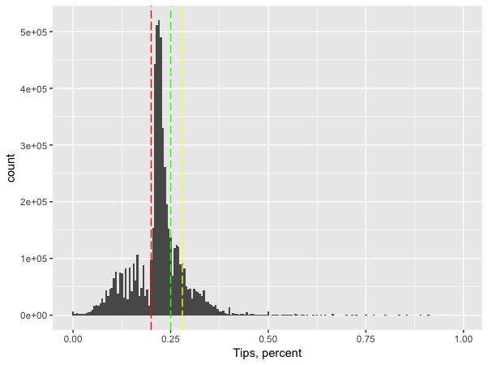
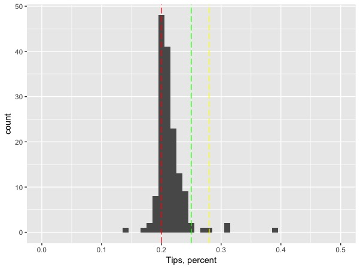
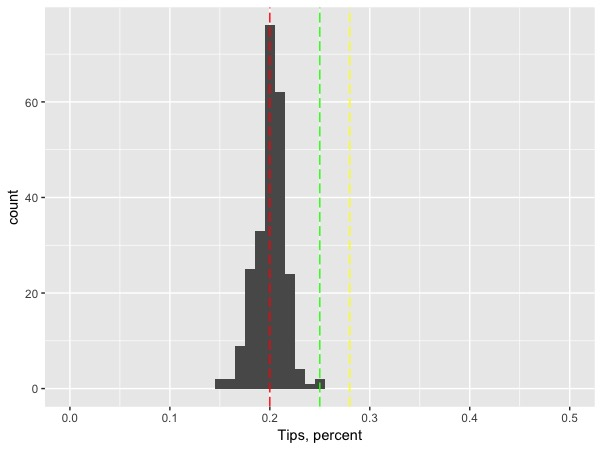

# Using New York City Yellow Taxi Data to Answer Real Life Problems {#chapter2}

New York City taxi drivers, passengers, and NYC Taxi & Limousine Commission are the three parties who are closely involved in the NYC taxi industry. Each party has its own needs: taxi drivers want to maxmize their profit, and in order to do that, they need to maximize the revenue while minimizing the cost. Taxi passengers want the cheapest and most convenient way of transportantion. Since Uber and Lyft launched their services in New York City, many consumers started to demand the cheaper e-hail services. TLC wants to protect both taxi drivers and passengers, and it creates policies to make NYC taxi more accessible to consumers who really need this service. In this section, I think about what each party wants and try to find a way for them to be better-off. 

## New York City Taxi Driver
### Which pick-up zone has the highest tip?
#### Trip-level Tip Inofrmation
The income of Taxi drivers in New York City has two parts: taxi fare and tips. Taxi fare is usually calculated by the meters installed in the taxis, and the rate of fare cannot be changed by taxi drivers. Therefore, in order to make more profit, taxi drivers prefer to pick up passengers who offer big amount of tips. What are the regions that provide the most tips to yellow taxicab drivers?

In the following analysis, I will focus on trip data collected in August 2016. Taxi drivers usually does not correctly record the amount of tips paid by cash or check. Therefore, in order to find out the regions that offer the most tips, we need to filter out the trips that are not paid by credit or debit card.

```{r}
yellow_2016.08_tip <- yellow_2016.08 %>%
  filter(fare_amount > 0) %>%
  filter(tip_amount > 0) %>%
  filter(payment_type == 1) %>%
  filter(tip_amount < fare_amount)
```

Instead of the absolute amount of tips, we want to focus on the percentage of tips that passengers pay in addition to the total fare amount. 

```{r}
yellow_2016.08_tip <- yellow_2016.08_tip %>%
  mutate(tip_perct = tip_amount/fare_amount)
```

Let's visualize the distribution of tip percentage:
```{r, eval=FALSE}
library(ggplot2)
tip_individual <- ggplot(data = yellow_2016.08_tip, aes(x = tip_perct) ) +
  xlab("Tips, percent") +
  geom_histogram(binwidth = 0.005) + 
  geom_vline(xintercept = c(0.20), col = "red",linetype = "longdash") +
  geom_vline(xintercept = c(0.25), col = "green",linetype = "longdash") +
  geom_vline(xintercept = c(0.28), col = "yellow",linetype = "longdash")
tip_individual
```


One of the questions that I always wonder is whether longer trips result in higher tip percent. It takes taxi drivers more time to complete longer trips, so passengers might want to compensate taxi drivers more. I personally pay higher percent of tips for longer rides, so I believe trip distance has an impact on percentage of tips paid.

```{r}
tip_distance <- lm(tip_perct ~ trip_distance, data = yellow_2016.08_tip)
summary(tip_distance)
```

Acoording to the simple linear regression result, trip distance does not have significant impact on the percent of tips paid.

#### Aggregated Zone-level Tip Information

```{r}
tip_region <- yellow_2016.08_tip  %>%
  group_by(PULocationID, DOLocationID) %>%
  summarise(avg_tip = mean(tip_perct), trips = n(),
            avg_dis = mean(trip_distance)) %>%
  filter(trips > 10) %>%
  arrange(desc(avg_tip)) %>%
  rename(LocationID = PULocationID) %>%
  left_join(taxi_zone_lookup, by = "LocationID")
```

```{r, eval=FALSE}
region_vis <- ggplot(data = tip_region, aes(x = avg_tip) ) +
  xlab("Tips, percent") +
  geom_histogram(binwidth = 0.005) + 
  geom_vline(xintercept = c(0.20), col = "red",linetype = "longdash") +
  geom_vline(xintercept = c(0.25), col = "green",linetype = "longdash") +
  geom_vline(xintercept = c(0.28), col = "yellow",linetype = "longdash") + 
  scale_x_continuous(limits = c(0, 0.5))
```


Taxi drivers are required to be indifferent to where passengers want to go.

```{r, eval=FALSE}
tip_pickup <- tip_region %>%
  group_by(LocationID) %>%
  summarise(avg_tip = mean(avg_tip)) %>%
  left_join(taxi_zone_lookup, by = "LocationID")

region_pickup_vis <- region_vis %+% tip_pickup
region_pickup_vis
```


```{r, eval=FALSE}
tip_dropoff <- tip_region %>%
  group_by(DOLocationID) %>%
  summarise(avg_tip = mean(avg_tip)) %>% 
  rename(LocationID = DOLocationID) %>%
  left_join(taxi_zone_lookup, by = "LocationID")

region_dropoff_vis <- region_pickup_vis %+% tip_dropoff
region_dropoff_vis
```

### Which pick-up zone has the highest price per minute
estmate slow traffic time


## New York City Taxi Consumer
### Does taxi fare change through time? Is taxi ride becoming more expensive?


## New York City Taxi Fare & Limousine Commission
### Should there be a flat rate to the JFK Airport?

Why is there a flat rate to and from JFK airport and any location in Manhattan? Why is the flat rate \$52? Does TLC make profit from the \$52 flat rate? Does \$52 reduce the cogestion on the road to JFK airport and make taking a train a more preferable choice?

Imagine you are travelling to New York City and you do not know much about the city. 
nice for people who are not from nyc

Compute for each pick up zone, the expected fare to JFK and plot that, and find out the zone that are close to 52

PPL who have the higher fare would not take cab
Closer regions?

Should there be one universal flat rate? Should their be multiple ones? Should their be one flat rate for each brough?
where is 52 dollar


