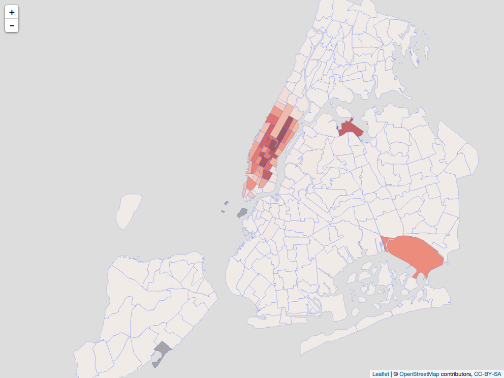

```{r, message=FALSE, echo=FALSE}
#library(knitr)
opts_chunk$set(tidy.opts=list(width.cutoff=50),tidy=TRUE,
               fig.width=6, fig.height=6)
```

# New York City Taxi Driver {#chapter3}
## Trip-level Tip Inofrmation
The income of Taxi drivers in New York City has two parts: taxi fare and tips. Taxi fare is usually calculated by the meters installed in the taxis, and the rate of fare cannot be changed by taxi drivers. Therefore, in order to make more profit, taxi drivers prefer to pick up passengers who offer big amount of tips. What are the regions that provide the most tips to yellow taxicab drivers?

In the following analysis, I will focus on trip data collected in August 2016. Taxi drivers usually does not correctly record the amount of tips paid by cash or check. Therefore, in order to find out the regions that offer the most tips, we need to filter out the trips that are not paid by credit or debit card.

```{r, message=FALSE, echo=FALSE}
library(dplyr)
library(readr)
yellow_2016.08_cleaned <- read_csv("~/Desktop/Honors Thesis/thesis/index/data/yellow_2016.08_cleaned.csv")
```

```{r}
yellow_2016.08_tip <- yellow_2016.08_cleaned %>%
  filter(fare_amount > 0) %>%
  filter(tip_amount > 0) %>%
  filter(payment_type == 1) %>%
  filter(tip_amount < fare_amount)
```

Instead of the absolute amount of tips, we want to focus on the percentage of tips that passengers pay in addition to the total fare amount. Therefore, we use tip amount over fare amount to calculate the percent tip.

```{r}
yellow_2016.08_tip <- yellow_2016.08_tip %>%
  mutate(tip_perct = tip_amount/fare_amount)
```

Let's visualize the distribution of percent tip of all trips occurred in August 2016:
```{r tip-individual, fig.cap="Percent Tip Paid by Passengers on Individual Yellow Taxi Trip in NYC"}
library(ggplot2)
tip_individual <- ggplot(data = yellow_2016.08_tip, aes(x = tip_perct) ) +
  xlab("Tips, percent") +
  geom_histogram(binwidth = 0.005) + 
  geom_vline(xintercept = c(0.20), col = "red",linetype = "longdash") +
  geom_vline(xintercept = c(0.25), col = "green",linetype = "longdash") +
  geom_vline(xintercept = c(0.28), col = "yellow",linetype = "longdash")
tip_individual
```

## Aggregated Zone-level Tip Information
Instead of studying factors that affect individual trips' percent tip, it is more useful to study the aggregated effect of each zone on percent tip.

```{r}
data(taxi_zone_lookup)
```

Taxi drivers are required to be indifferent to where passengers are going. Therefore, it makes sense to investigate the average amount of tips paid for each pick-up zone. What are the taxi pick-up zones that have the highest tip percents?

We first calculate the average percent tip paid for each pick-up zone. Here is a list of pick-up zones with their average percent tip:
```{r, message=FALSE}
tip_pickup <- yellow_2016.08_tip %>%
  group_by(PULocationID) %>%
  summarise(avg_tip = mean(tip_perct), 
            num_trips=n(),
            avg_dis = mean(trip_distance)) %>%
  rename(LocationID = PULocationID)%>%
  left_join(taxi_zone_lookup, by = "LocationID") %>%
  arrange(desc(avg_tip)) %>%
  filter(Zone != "Unknown")

#library(knitr)
kable(tip_pickup[1:10,], caption = "Ten taxi pick-up zones with the highest average tip without any threshold")
```

Below is a histogram of average percent tips paid for all pick-up zones. As show on the plot, the first peak is around 20%, which is the cheapest default option on the touch panel for passengers to chose. 

```{r pickup-vis, fig.cap = "Percent Tip Paid by Passengers on Each Pick-up Taxi Zone in NYC"}
pickup_vis <- ggplot(data = tip_pickup, aes(x = avg_tip) ) +
  xlab("Tips, percent") +
  geom_histogram(binwidth = 0.005) + 
  geom_vline(xintercept = c(0.20), col = "red",linetype = "longdash") +
  geom_vline(xintercept = c(0.25), col = "green",linetype = "longdash") +
  geom_vline(xintercept = c(0.28), col = "yellow",linetype = "longdash") + 
  scale_x_continuous(limits = c(0, 0.5))
pickup_vis
```

```{r tip-region, fig.cap="Percent Tip Paid by Passengers on Each Pick-up And Drop-off Pair in NYC"}
tip_region <- yellow_2016.08_tip  %>%
  group_by(PULocationID, DOLocationID) %>%
  summarise(avg_tip = mean(tip_perct), 
            trips = n(),
            avg_dis = mean(trip_distance)) %>%
  #filter(trips > 10) %>%
  arrange(desc(avg_tip)) %>%
  rename(LocationID = PULocationID) %>%
  left_join(taxi_zone_lookup, by = "LocationID")
#zone
region_vis <- pickup_vis %+% tip_region
region_vis
```
The 20% peak is more clearly shown when we calculate the percent tips for each pick-up and drop-off locatins pair instead of pick-up location only.

**Does trip distance increase the percent tips paid?** 
One of the questions that I always wonder is whether longer trips result in higher tip percent. It takes taxi drivers more time to complete longer trips, so passengers might want to compensate taxi drivers more. I personally pay higher percent of tips for longer rides, so I believe trip distance has an impact on percentage of tips paid.

```{r}
tip_distance <- lm(avg_tip ~ avg_dis + LocationID + DOLocationID, data = tip_region)
summary(tip_distance)$coef[1:2,]
```
Acoording to the simple linear regression result, trip distance does not have significant impact on the percent of tips paid, controlling for both pick-up and drop-off locations.

## Which zones have the highest percent tip?
Let's fist take a look at which pick-up zones have the highest number of pickups. 

```{r, message=FALSE}
data("taxi_zones")
library(sp)
pick_up_zones <- merge(taxi_zones, tip_pickup, by.x = "LocationID", by.y = "LocationID")
```

We can create a heat map to visulizae the number of trip for each pick-up zones on a map of New York City Taxi Zones.
```{r num-trip, fig.cap="Number of Pick-ups in Each Taxi Zone"}
library(leaflet)

reds = colorNumeric("Reds", domain = NULL)
#create visulization
# leaflet(data = pick_up_zones) %>%
#   addTiles() %>%
#   addPolygons(fillColor = ~reds(num_trips),
#               fillOpacity = 0.6,
#               weight = 1,
#               opacity = 0.8) %>%
#   setView(lat = 40.7128, lng = -74.0060, zoom = 10)
# 
# library(htmlwidgets)
# saveWidget(m, file = "/Users/priscilla/Desktop/Honors Thesis/writing/figures/temp.html")
# URL <- "/Users/priscilla/Desktop/Honors Thesis/writing/figures/temp.html"
# webshot(URL, cliprect = "viewport")
```

It's obivous that Manhattan, La Guardia Airport, and JKF Airport have the most number of pick-ups.

Most yellow cab pick-ups occur in Manhattan. If we focus on the pick-up zones that have more than 900 trips per month or 30 trips per day, then we observe that many pick-up zones that have the highest percent tips are in Brooklyn. 
```{r}
#pick a threshold for the cutoff number of trips
pickup_zone_900 <- tip_pickup %>%
  filter(num_trips >= 900) %>%
  arrange(desc(avg_tip))

#pickup_zone_900 %>% head(10)
kable(pickup_zone_900[1:10, ], caption = "Ten taxi pick-up zones with the highest percent tip with threshold equals to 900")
```
People might think it is more reasonable to ses a list that is populated with Zones in Manhattan, since that's where all the wealthy people live. However, it turns out that passengers who get on taxis in Brooklyn pays more tips.

If we focus on the pick-up zones that have more than 90000 trips per month or 3000 trips per day, then we observe that all pick-up zones that have the highest percent tips are in Manhattan besides La Guardia Airport.
```{r}
#pick a threshold for the cutoff of number of trips
pickup_zone_90000 <- tip_pickup %>%
  filter(num_trips >= 90000) %>%
  arrange(desc(avg_tip))
#pickup_zone_90000 %>% head(10)
kable(pickup_zone_90000[1:10,], caption = "Ten taxi pick-up zones with the highest percent tip with threshold equals to 90000")
```
There are more than 100 times more yellow cab pick-ups that happen in Manhattan everyday than in Brooklyn, and that is why there are many dense red-shade polygons in the visulization above.

## Do taxi drivers tend to go to zones that offer high tips?
So far, we have learned what pick-up zones offer the highest percent tip. Now, we want to dig into the relationships between percent tip and taxi-zone-specific variables. 

It is not easy to find an available taxi on the street on New York City, because the demand for taxi trips is much higher than the supply. Does paying more tips help customers to more easily get taxis? If customers from certain regions keep paying higher tips, taxi drivers might be able to learn from their experiences in those regions, and be more willing to wonder around those regions more often and pick up passengers. Pick-up zones with higher tips should attract more taxi drivers with the control of taxi zones. Let's test it out and see whether it is true:
```{r}
tip_region$LocationID <- as.character(tip_region$LocationID)
tip_pickup$LocationID <- as.character(tip_pickup$LocationID)
tip_and_trip_1 <- lm(trips ~ avg_tip + LocationID, data = tip_region)
#summary(tip_and_trip_1)
summary(tip_and_trip_1)$coef[1:2,]
```

Each one percent increase in average tips in pick-up zones is associated with 1447.2714 increase in the number of trips per month, controlling the pick-up zone. 

```{r}
9942263/31
1447.2714/31
```
In August 2016, yellow cabs made an average of 320,718 daily trips. Additionally, each one percent increase in average tips in pick-up zones is associated with 47 increase in the number of trips per day in a specific pick-up zone.

### Which pick-up zone has the highest price per minute?
New York City Taxi Fare & Limousine Commission has information on how New York City taxi fare amount is calculated on their [official website](http://www.nyc.gov/html/tlc/html/passenger/taxicab_rate.shtml). 

**Metered Fare Information**
**Onscreen rate is ‘Rate #01 – Standard City Rate.’**
*The initial charge is $2.50.
*Plus 50 cents per 1/5 mile or 50 cents per 60 seconds in slow traffic or when the vehicle is stopped.
*In moving traffic on Manhattan streets, the meter should “click” approximately every four downtown blocks, or one block going cross-town (East-West).
*There is a 50-cent MTA State Surcharge for all trips that end in New York City or Nassau, Suffolk, Westchester, Rockland, Dutchess, Orange or Putnam Counties.
*There is a 30-cent Improvement Surcharge. 
*There is a daily 50-cent surcharge from 8pm to 6am.
*There is a $1 surcharge from 4pm to 8pm on weekdays, excluding holidays.
*Passengers must pay all bridge and tunnel tolls.
*Your receipt will show your total fare including tolls. Please take your receipt.
*The driver is not required to accept bills over $20.
*Please tip your driver for safety and good service.
*There are no charges for extra passengers or bags.

In taxi fare calculation, the only unknown variable is slow-trafice time, and all other variables were collected by the meters installed on each medallion taxi for each trip. It is reasonable to assume that for trips with the same pick-up and drop-off locations, the longer the total slow traffic time is, the longer the trip would take. Taxi drivers are compensated for both the normal-speed trip distance and the time spent in slow-traffice. According to the fare calculation algorithm, in moving traffic on Manhattan streets, the meter should “click” approximately every four downtown blocks, or one block going cross-town (East-West); in slow traffic, the meter should "click" every 60 seconds. Therefore, slow traffic reduces the fare per minute ratio. 

New York CIty has the worst traffic jam, and it has overtaken Miami to be voted the U.S. city with the angriest and most aggressive drivers in 2009, according to a survey on road rage released on Tuesday. Bad traffic also cause slow-traffic, and taxi drivers tend to suck in traffic during rush hours. Does fare per minute ratio have an impact on the percent tip that passengers pay? Do passengers compensate taxi drivers more during rush hours? Are passengers sympathetic to taxi drivers for the time they spend in slow traffic?

```{r, message=FALSE}
library(lubridate)
yellow_2016.08_time <- yellow_2016.08_tip %>%
  mutate(duration = round((tpep_dropoff_datetime - tpep_pickup_datetime)/60, 2)) %>%
  mutate(duration = as.numeric(duration)) %>%
  filter(duration > 0) %>%
  mutate(fare_per_min = fare_amount/duration)

#summary(yellow_2016.08_time$fare_per_min)
fare_min_ratio <- lm(tip_perct ~ fare_per_min, data = yellow_2016.08_time)
summary(fare_min_ratio)
```

As shown in the regression result, fare per minute ratio has a significant negative impact on percent tip. Since having more slow traffic time spent on the road reduces the fare per minute ratio, slow traffice does increase the impact on percent tip. Passengers do pay more tips to taxi drivers during rush hours.

