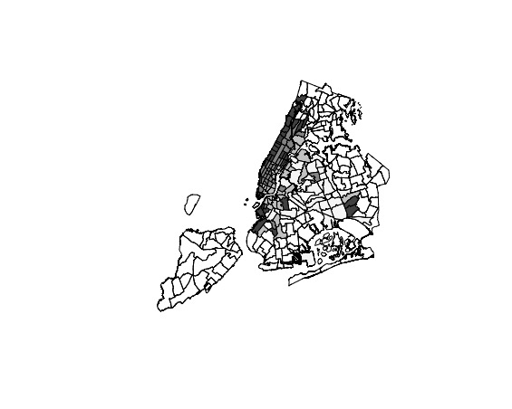

## New York City Taxi Fare & Limousine Commission
### Should there be a flat rate between Manhattan and the JFK Airport?

#### People in Manhattan benefit from the $52 flat rate.
Why is there a flat rate to and from JFK airport and any location in Manhattan? Why is the flat rate \$52? Does TLC make profit from the \$52 flat rate? Does \$52 reduce the cogestion on the road to JFK airport and make taking a train a more preferable choice?

If there is no flat rate between JFK and Manhattan, 

```{r, eval=FALSE}
jfk_trip <- yellow_2016.08_cleaned %>%
  filter(RatecodeID == 2) %>%
  filter(payment_type != 3) %>%
  filter(trip_distance > 0) %>%
  filter(fare_amount > 0) %>%
  filter(PULocationID != DOLocationID) %>%
  mutate(est_fare = 2.5 + 0.5 * trip_distance * 5 + extra + 
           improvement_surcharge + mta_tax + tolls_amount,
         est_diff = est_fare - fare_amount)

to_jfk <- jfk_trip %>%
  filter(DOLocationID == 132)

from_jfk <- jfk_trip %>%
  filter(PULocationID == 132)
```


```{r, eval=FALSE}
to_jkf_zone <- to_jfk %>%
  group_by(PULocationID) %>%
  summarise(num_trips = n(),
            avg_dis = mean(trip_distance),
            avg_fare = mean(est_fare))

to_jkf_fare <- merge(taxi_zones, to_jkf_zone, by.x = "LocationID", by.y = "PULocationID")
library(RColorBrewer)
cols <- brewer.pal(n = 4, name = "Greys")
lcols <- cut(to_jkf_fare$avg_fare,
             breaks = quantile(to_jkf_fare$avg_fare, na.rm = TRUE),
             labels = cols)
plot(to_jkf_fare, col = as.character(lcols))
```




```{r, eval=FALSE}
to_jkf_zone_above <- to_jkf_zone %>%
  filter(avg_fare >= 52) %>%
  arrange(desc(avg_fare))
kable(to_jkf_zone_above[1:10,], caption = "Zones that woulde have paid more than $52")
```

---
# A tibble: 41 x 6
   LocationID num_trips  avg_dis avg_fare   Borough                     Zone
        <int>     <int>    <dbl>    <dbl>    <fctr>                   <fctr>
 1         13      1266 22.09787 62.44055 Manhattan        Battery Park City
 2        244        74 20.42216 60.27892 Manhattan Washington Heights South
 3        239      1685 20.47249 60.11053 Manhattan    Upper West Side South
 4        261       723 21.22151 59.59012 Manhattan       World Trade Center
 5        143       655 20.53586 59.26524 Manhattan      Lincoln Square West
 6        238      1233 19.93394 59.02019 Manhattan    Upper West Side North
 7         12        41 20.62537 58.44146 Manhattan             Battery Park
 8         88       362 20.30909 57.79963 Manhattan Financial District South
 9        151       637 19.39038 57.71180 Manhattan         Manhattan Valley
10        116        67 19.27463 57.54149 Manhattan         Hamilton Heights
---

Imagine you are travelling to New York City and you do not know much about the city. Travellers tend to gather around Mahanttan, and without the flat rate, passengers would have paid more than $52 to take a taxi to go to the JFK Airport. The \$52 flat rate is nice for people who are not very familiar with New York City, and it incentivize tourists to take taxi to the JFK Airport. It also helps taxi drivers to get more tips to JFK Airport.

### However, are taxi drivers happy with the flat rate? 

What the expected fare from JKF Airport
how much time it would take for a cb driver to do a round trip 

 


