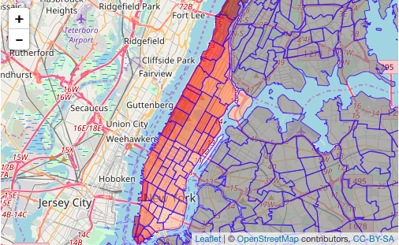
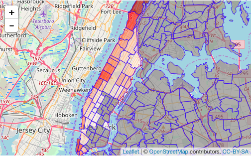
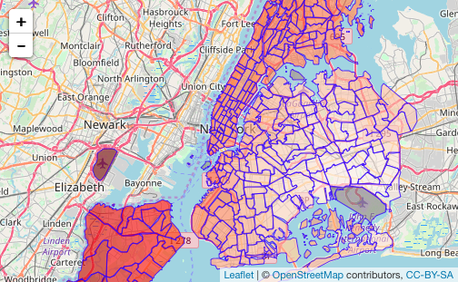
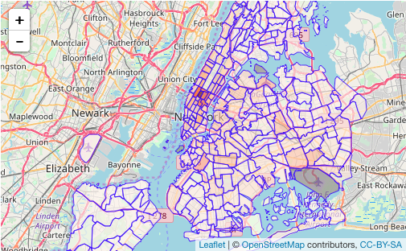

# New York City Taxi Fare & Limousine Commission {#chapter5}

## Should there be a flat rate between Manhattan and John F. Kennedy International Airport?
Why is there a flat rate to and from JFK airport and any location in Manhattan? Why is the flat rate \$52? Does TLC make profit from the \$52 flat rate? Does \$52 reduce the cogestion on the road to JFK airport and make taking a train a more preferable choice? The New York City taxi trip records can reveal the answers to these questions.

Imagine it's your first time travelling to New York City, and you decided to live in a hotel in Manhattan Since you do not know much about the city, the \$52 flat rate is nice for you, and it incentivizes you to take taxi to the JFK Airport. If there is no flat rate, there is uncertainty in how much someone needs to pay to take a taxi to JFK, and tourists might instead choose to take the train, even though taking a train would cost them more time and inconvenience. 

Additionally, people who are native to Manhattan would have paid more than $52 to take a taxi to go to the JFK Airport. The higher the taxi fare is, the less the demand for taxi will be. Therefore, having a flat rate,helps taxi drivers to get more trips from Manhattan to JFK Airport.

### People in Manhattan benefit from the $52 flat rate.
If there is no flat rate between JFK and Manhattan, how much would passengers pay for the distance they travelled between JFK Airport AND Manhattan? And how much more or less should they have paid comparing to the \$52 flat rate?

```{r, echo=FALSE}
db <- src_mysql("nyctaxi", user = "wli37", host = "scidb.smith.edu", password = "Calculati0n")
taxi <- etl("nyctaxi", db)
```

In this study, we are only interested in yellow taxi trip between Manhattan and JFK Airport.
```{r, message=FALSE}
# jfk_trip <- taxi %>%
#   tbl("yellow") %>%
#   filter(RatecodeID == 2) %>%
#   collect()

jfk_trip <- yellow_2016.08_cleaned %>%
  filter(RatecodeID == 2) %>%
  filter(payment_type != 3) %>%
  filter(trip_distance > 0) %>%
  filter(fare_amount > 0) %>%
  filter(PULocationID != DOLocationID)
```

**Trips from Manhattan to JFK Airport**
We first focus on all the trips that departed in Manhattan and went to JFK Airport, and then we calculate the estmated fare amount that the passengers should have paid based on the distance travelled from each pick-up point to JFK Airport based on the fare rate suggested by TLC for each pick-up zone. 

```{r, message=FALSE}
data("taxi_zone_lookup")
to_jfk <- jfk_trip %>%
  filter(DOLocationID == 132) %>%
  mutate(est_fare = 2.5 + 0.5 * trip_distance * 5 + extra + improvement_surcharge + mta_tax + tolls_amount) %>%
  mutate(est_diff = est_fare - fare_amount) %>%
  rename(LocationID = PULocationID) %>%
  left_join(taxi_zone_lookup , by = "LocationID") %>%
  filter(Borough == "Manhattan")

to_jkf_zone <- to_jfk %>%
  group_by(LocationID) %>%
  summarise(num_trips = n(), 
            avg_est_fare = mean(est_fare),
            avg_est_diff = mean(est_diff)) %>%
  left_join(taxi_zone_lookup , by = "LocationID")
```

Here is a map of estmated fare amount calculated by taking the average of all estimated fare amounts from the same pick-up zone to JFK Airport based on the fare rate suggested by TLC for each pick-up zone. 
```{r}
to_jkf_fare <- merge(taxi_zones, to_jkf_zone, by.x = "LocationID", by.y = "LocationID")

# leaflet(data = to_jkf_fare) %>%
#   addTiles() %>%
#   addPolygons(fillColor = ~reds(avg_est_fare),
#               fillOpacity = 0.6,
#               weight = 1,
#               opacity = 0.8) %>%
#   setView(lat = 40.7128, lng = -74.0060, zoom = 10)
```

According to the map, trips from Midtown on average cost less than trips from other taxi zones in Manhattan.

```{r}
to_jkf_zone_above <- to_jkf_zone %>%
  filter(avg_est_fare > 52) %>%
  arrange(desc(avg_est_fare))

kable(to_jkf_zone_above[1:10,], caption = "Ten pick-up zones with the highest avergae fare from Manhattan to JKF Airport")
```

Let's visualize the taxi zones that would have costed more than the \$52 flat rate.

```{r}
to_jkf_fare_above <- merge(taxi_zones, to_jkf_zone_above, by.x = "LocationID", by.y = "LocationID")

# leaflet(data = to_jkf_fare_above) %>%
#   addTiles() %>%
#   addPolygons(fillColor = ~reds(avg_est_fare),
#               fillOpacity = 0.6,
#               weight = 1,
#               opacity = 0.8) %>%
#   setView(lat = 40.7128, lng = -74.0060, zoom = 10)

#add t test to test average fare vs 52
```

Therefore, passengers from places in Manhattan besides Midtown, East Village, and some parts of Lower Manhattan benefit from the $52 flat rate. However, people living in Midtown, East Village, and some parts of Lower Manhattan might be relatively more indifferent to the price of taxi. Instead, they probably put more emphasis on convenience and time.

```{r}
mean(to_jkf_zone$avg_est_diff)
```
On average people travel from Manhattan pay \$2.14 less with the \$52 flat rate policy.

## However, are taxi drivers happy when their passengers are going to JFK Airport from Manhattan?
Everytime I travel to New York City, I always take Yellow cabs to go around the city. It seemed to me that the cab drivers were always happy whenever they heard me telling them that I need to go to the JFK Airport from Manhattan. Are taxi drivers happy when their passengers are going to JFK Airport from Manhattan? How much on average would taxi driver make on their way bavk to the city from Manhattan? 

```{r}
from_jfk <- yellow_2016.08_cleaned %>%
  filter(PULocationID == 132) %>%
  filter(payment_type != 3) %>%
  filter(trip_distance > 0) %>%
  filter(fare_amount > 0) %>%
  filter(PULocationID != DOLocationID) %>%
  mutate(est_fare = 2.5 + 0.5 * trip_distance * 5 + extra + improvement_surcharge + mta_tax + tolls_amount) %>%
  mutate(est_diff = est_fare - fare_amount)
```

Since a taxi driver coming from Manhattan to JFK Airport could be directed back to anywhere in the city. We can calculate the average taxi fare amount that the taxi drivers would get paid for a random trip from JFK Airport to any part of the city.

```{r}
mean(from_jfk$est_fare)
```

On average, taxi drivers would be paid for \$46.90 for a trip from the JFK Airport to any taxi zone. What are the most popular drop-off zones for yellow taxis from JFK Airport?
```{r}
from_jkf_zone <- from_jfk %>%
  group_by(DOLocationID) %>%
  summarise(num_trips = n(), 
            avg_est_fare = mean(est_fare),
            avg_est_diff = mean(est_diff)) %>%
  rename(LocationID = DOLocationID) %>%
  left_join(taxi_zone_lookup , by = "LocationID")
```


**What's the average fare to each dropp-off zone from JFK Airport? **

```{r}
from_jkf_fare <- merge(taxi_zones, from_jkf_zone, by.x = "LocationID", by.y = "LocationID")

# leaflet(data = from_jkf_fare) %>%
#   addTiles() %>%
#   addPolygons(fillColor = ~reds(avg_est_fare),
#               fillOpacity = 0.6,
#               weight = 1,
#               opacity = 0.8) %>%
#   setView(lat = 40.7128, lng = -74.0060, zoom = 10)
```

As we expected, the red shades are smoothly distributed, since taxi zones that are futher away should cost more to get there.

```{r}
# leaflet(data = from_jkf_fare) %>%
#   addTiles() %>%
#   addPolygons(fillColor = ~reds(num_trips),
#               fillOpacity = 0.6,
#               weight = 1,
#               opacity = 0.8) %>%
#   setView(lat = 40.7128, lng = -74.0060, zoom = 10)
```

According to the map above, Manhattan is still the most popular destination for passengers depart from the JFK Airport. 

```{r}
from_jkf_zone %>%
  mutate(Manhattan = ifelse(Borough == "Manhattan", 1, 0)) %>%
  group_by(Manhattan) %>%
  summarise(all_trips = sum(num_trips))
```
According to the summary, the total amount of trips from JFK Airport to Manhattan is 10% more than the total number of trips travelling from JFK Airport to all other Borough. Therefore, it is very likely for taxi drivers to get passengers who want to go to Manhattan with a flat rate of \$52. In this case, a round trip to and from JFK Airport is worthy. Therefore, taxi drivers should be pretty happy when their passengers are going to JFK Airport from Manhattan. 

## How does weather affect the number of taxi and Lyft trips?
According to Schneider (2015), there are lots of confounding variables between weather and taxi rides, including seasonal trends, annual growth due to boro taxis, and whether weather events happen to fall on weekdays or weekends, but it would appear that snowfall has a significant negative impact on daily taxi ridership. In this section, we use New York City Yellow Taxi and Lyft data to calculate the number of trips occurred on and before snow days.
```{r, message=FALSE, warning=FALSE}
taxi_summary_2017 <- taxi %>%
  tbl("yellow") %>%
  mutate(year = year(tpep_pickup_datetime),
         month = month(tpep_pickup_datetime)) %>%
  group_by(year, month) %>%
  summarise(N = n()) %>%
  collect()

taxi_sum <- taxi_summary_2017 %>%
  mutate(year_month = paste0(year, "-", stringr::str_pad(month, 2, "left", "0"), "-01")) %>%
  mutate(time = as.POSIXct(year_month))

library(plotly)
p <- plot_ly(x = ~taxi_sum$time, y = ~taxi_sum$N, mode = 'lines')
p
```

I downloaded daily Central Park weather data from the National Climatic Data Center, and joined it to the taxi data to see if we could learn anything else about the relationship between weather and taxi rides. 


